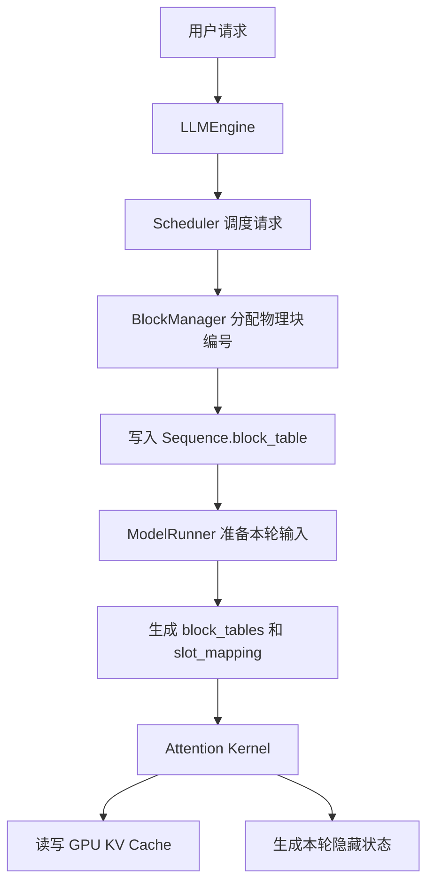

# nano-vLLM 面试题：ModelRunner 与 BlockManager 如何协作

> 面试题：ModelRunner 和 BlockManager 之间如何传递信息？BlockManager 接收什么参数完成 Block/KV Cache 分配？BlockManager 整个类做了什么？`allocate` 和 `deallocate` 分别做了什么？

## 一、先给出面试标准回答

`BlockManager` 和 `ModelRunner` 不会直接互相调用，也不会在二者之间传递真实的 K/V 张量。

- `BlockManager` 位于 CPU 调度侧，负责管理 KV Cache 的**物理块编号**：哪些块空闲、哪些块正在使用、一个块被多少请求共享，以及请求的逻辑块映射到哪些物理块。
- 分配结果写入 `Sequence.block_table`。例如 `[2, 5, 9]` 表示该请求的第 0、1、2 个逻辑块分别映射到 GPU KV Cache 的第 2、5、9 个物理块。
- `ModelRunner` 位于 GPU 执行侧，提前创建真实的 KV Cache 张量。执行 Prefill 或 Decode 前，它读取每个请求的 `block_table`，生成 GPU Kernel 需要的 `block_tables` 和 `slot_mapping`。
- Attention Kernel 根据这些映射，把新 Token 的 K/V 写入正确的 GPU Cache 位置，并在计算注意力时读取历史 K/V。

一句话总结：

> **BlockManager 分配页号，Sequence 携带页表，ModelRunner 将页表转换成 GPU 可用的地址映射，Attention Kernel 真正读写 KV。**

## 二、整体调用关系



这里的核心中间对象是 `Sequence`。`Scheduler`、`BlockManager` 和 `ModelRunner` 都会读取或修改它，因此它相当于几个组件之间共享的请求状态。

## 三、BlockManager 接收什么参数

### 1. 初始化参数

```python
BlockManager(num_blocks, block_size)
```

- `num_blocks`：整个 KV Cache 一共有多少个可分配的物理块。
- `block_size`：每个物理块能够保存多少个 Token 的 K/V，本项目默认是 256。

`BlockManager` 初始化时只创建 CPU 侧元数据，并不申请真正的 GPU KV Cache：

```text
blocks               每个物理块的元数据
free_block_ids       空闲物理块编号队列
used_block_ids       已使用物理块编号集合
hash_to_block_id     前缀哈希到物理块编号的映射
```

每个 `Block` 保存：

- `block_id`：物理块编号；
- `ref_count`：当前有多少个请求共享该块；
- `hash`：用于前缀缓存匹配的哈希；
- `token_ids`：该缓存块对应的 Token，用于防止哈希碰撞造成误匹配。

### 2. 为请求分配时的参数

```python
allocate(seq, num_cached_blocks)
```

- `seq`：当前请求对象，包含 Token、缓存长度、块表等状态；
- `num_cached_blocks`：有多少个完整前缀块可以直接复用。

所以，BlockManager 并不接收 K Tensor、V Tensor、显存地址或模型隐藏维度。它只根据请求需要的块数和前缀缓存命中情况分配**块编号**。

## 四、真实的 GPU KV Cache 在哪里创建

真实显存由 `ModelRunner.allocate_kv_cache()` 一次性预分配：

```python
self.kv_cache = torch.empty(
    2,
    num_kv_layers,
    num_kvcache_blocks,
    block_size,
    num_kv_heads,
    head_dim,
)
```

可以把它理解成：

```text
维度 0：K 或 V
维度 1：Full Attention 层
维度 2：物理块编号
维度 3：块内 Token 位置
维度 4：KV Head
维度 5：Head Dimension
```

因此物理块 2 不是一个独立的 Python 对象，也不是某个字节地址；它是 KV Cache 张量第三个维度上的索引。

对于同一个物理块 2：

```text
K 的位置：kv_cache[0, layer, 2, :, :, :]
V 的位置：kv_cache[1, layer, 2, :, :, :]
```

K 和 V 属于同一个块编号体系，但保存在张量中不同的区域。

## 五、ModelRunner 与 BlockManager 如何传递信息

严格来说，它们是通过 `Scheduler + Sequence` **间接传递元数据**的。

假设：

```text
block_size = 256
请求需要 600 个 Token 的 KV
seq.block_table = [2, 5, 9]
```

逻辑到物理的映射为：

| 逻辑 Token 范围 | 逻辑块 | 物理块 | 块内位置 |
|---|---:|---:|---:|
| 0～255 | 0 | 2 | 0～255 |
| 256～511 | 1 | 5 | 0～255 |
| 512～599 | 2 | 9 | 0～87 |

某个逻辑 Token 位置 `p` 对应的物理 Slot 为：

```python
logical_block = p // block_size
offset_in_block = p % block_size
physical_block = seq.block_table[logical_block]
physical_slot = physical_block * block_size + offset_in_block
```

`ModelRunner` 会把这些 `physical_slot` 组成 `slot_mapping`，传入 Attention 上下文。

- `slot_mapping`：告诉 Kernel 本轮新生成的 K/V 应写到哪个物理 Slot；
- `block_tables`：告诉 Paged Attention 历史逻辑块分别位于哪些物理块；
- `context_lens`：告诉 Decode Kernel 每个请求当前可读取多少个物理 KV Token。

因此传递的不是 K/V 内容，而是**寻找 K/V 的映射关系**。

## 六、BlockManager 整个类具体做什么

### 1. 管理空闲块和已用块

```text
free_block_ids：还可以分配的块
used_block_ids：当前正在使用的块
```

### 2. 判断请求能否进入运行

`can_allocate(seq)` 会：

1. 计算请求需要多少块；
2. 检查是否能命中完整的前缀缓存块；
3. 计算还要新分配多少块；
4. 空闲块不足时返回 `-1`，Scheduler 暂时不让请求进入运行。

### 3. 为 Prefill 分配块

`allocate(seq, num_cached_blocks)` 复用已命中的前缀块，并为剩余部分领取新块。

### 4. 为 Decode 追加块

- `can_append(seq)`：判断写入下一个 Token 时，是否有足够空间；
- `may_append(seq)`：当前物理 KV 长度正好到达块边界时，再领取一个新块。

不是每生成一个 Token 都申请一个块。只有现有块写满时，才需要领取下一块。

### 5. 回收请求占用的块

`deallocate(seq)` 在请求完成或被抢占时释放引用。

### 6. 管理前缀缓存

`hash_blocks(seq)` 为已经完整计算的块建立链式哈希，使后续具有相同 Token 前缀的请求可以复用 KV 块。

压缩后的 KV 已经不是连续的原始 Token 前缀，因此本项目会跳过它的前缀缓存登记，避免错误复用。

## 七、allocate 具体做了什么

`allocate(seq, num_cached_blocks)` 可以拆成四步。

### 第一步：确认请求还没有块表

```python
assert not seq.block_table
```

避免对同一个请求重复执行首次分配。

### 第二步：复用命中的前缀缓存块

对前 `num_cached_blocks` 个逻辑块：

1. 根据 Token 和前一块哈希计算链式哈希；
2. 从 `hash_to_block_id` 找到物理块；
3. 如果该块正在使用，增加 `ref_count`；
4. 如果该块处于空闲队列，把它重新移到已用集合；
5. 将块编号追加到 `seq.block_table`。

引用计数的意义是：多个请求可以共享相同的只读前缀 KV。只有最后一个请求释放它时，该块才重新变为空闲。

### 第三步：为剩余逻辑块领取新物理块

```python
for i in range(num_cached_blocks, seq.num_blocks):
    seq.block_table.append(self._allocate_block())
```

`_allocate_block()` 内部会：

1. 从 `free_block_ids` 队首取出一个编号；
2. 清除这个编号以前对应的过期哈希映射；
3. 将块的 `ref_count` 重置为 1；
4. 清空旧哈希和旧 Token 元数据；
5. 把编号加入 `used_block_ids`。

### 第四步：初始化请求的 KV 状态

```text
num_cached_tokens       已完成计算的逻辑 Token 数
num_physical_kv_tokens  当前真正保留的物理 KV Token 数
kv_logical_indices      物理 KV 对应哪些原始逻辑 Token
kv_is_compressed        当前 KV 是否经过压缩
```

刚分配时只有命中的前缀块包含有效 KV，所以逻辑长度和物理长度都初始化为前缀命中的 Token 数。

### Qwen3.5 Hybrid 的特殊情况

当前项目在 Qwen3.5 Hybrid 模式下强制：

```python
num_cached_blocks = 0
```

原因是 Full Attention 的 KV 前缀缓存如果要安全复用，还必须同时恢复每一层 Gated DeltaNet 的 recurrent/conv state 快照。当前没有实现这套前缀状态快照，所以禁用 Hybrid 的前缀复用，以保证数值正确。

## 八、deallocate 具体做了什么

`deallocate(seq)` 用于请求结束或抢占重算时释放其块引用。

### 第一步：逆序遍历请求块表

```python
for block_id in reversed(seq.block_table):
```

逆序释放更符合请求尾部到头部的回收顺序，不过这里真正决定安全性的仍然是引用计数。

### 第二步：引用计数减一

```python
block.ref_count -= 1
```

- 如果 `ref_count > 0`，说明还有其他请求共享该前缀块，不能回收；
- 如果 `ref_count == 0`，调用 `_deallocate_block()` 把编号从已用集合移回空闲队列。

### 第三步：清空请求的 KV 元数据

```text
num_cached_tokens = 0
num_physical_kv_tokens = 0
kv_logical_indices = []
kv_is_compressed = False
block_table = []
```

注意：这里不会删除 `seq.token_ids`。

这是因为请求被抢占后会回到 Waiting，之后需要根据完整 Token 历史重新执行 Prefill，重建 KV Cache 和 DeltaNet State。

### 为什么释放块时不立刻清除 hash 和 token_ids

块的引用计数降到 0 后，块编号虽然进入空闲队列，但哈希元数据暂时保留，因此在该编号真正被其他内容覆盖前，它仍可能作为前缀缓存重新激活。

当 `_allocate_block()` 真正复用该编号时，才删除过期哈希并重置元数据。

## 九、Decode 阶段如何追加物理块

假设 `block_size = 256`：

- 已有 100 个物理 KV Token：最后一个块还有空间，不申请新块；
- 已有 255 个物理 KV Token：下一个 Token 仍写入当前块最后一个 Slot；
- 已有 256 个物理 KV Token：当前块已满，`may_append()` 领取一个新块；
- 已有 512 个物理 KV Token：再次到达块边界，需要领取下一个块。

对应判断为：

```python
seq.num_physical_kv_tokens % block_size == 0
```

这里使用的是**物理 KV 长度**，而不是逻辑 Token 总长度，因为执行 KV 压缩后两者可能不再相等。

## 十、Fused KV Cache Compaction 中的块如何切换

压缩时不能直接覆盖旧块，因为旧 KV 仍是搬运操作的数据源。当前流程采用类似 Copy-on-Write 的方式：

1. `LLMEngine` 从 BlockManager 领取一组新物理块；
2. `ModelRunner` 调用压缩 Kernel，根据 `keep_indices` 把保留的 K/V 从旧块搬到新块；
3. 搬运完成后减少旧块的引用计数并回收无引用的块；
4. 将 `seq.block_table` 切换为新块表；
5. 更新物理 KV 长度和逻辑索引。

这样可以防止源地址和目标地址重叠导致尚未读取的数据被提前覆盖。

## 十一、BlockManager 不负责什么

BlockManager **不负责**：

- 创建 GPU KV Cache 张量；
- 计算 Q、K、V；
- 执行 Attention；
- 将 K/V 数据搬入显存；
- 管理 DeltaNet 的 recurrent/conv state 内容；
- 直接执行 CUDA/Triton Kernel。

其中，Hybrid 模型的 `state_slot` 编号由 `Scheduler` 分配和回收，真实的 recurrent/conv state pool 由 `ModelRunner` 中的模型模块持有。这套 State Pool 与 Full Attention 的 KV Block Pool 是两套不同的资源管理机制。

## 十二、常见错误回答

### 错误 1：BlockManager 给每个请求申请一块 GPU Tensor

不准确。GPU KV Cache 是 ModelRunner 提前一次性申请的大张量，BlockManager 只从中分配块编号。

### 错误 2：物理块编号就是显存地址

不准确。物理块编号是张量索引，需要结合层号、K/V、块内偏移、KV Head 和 Head Dimension 才能定位具体元素。

### 错误 3：ModelRunner 直接向 BlockManager 请求块

本项目中主要由 Scheduler 调用 BlockManager，再由 ModelRunner 读取 Scheduler 传来的 Sequence 状态。

### 错误 4：deallocate 会删除请求的全部 Token

不会。它清空的是 KV 块映射和缓存状态，Token 历史仍保留，以支持抢占后的重算。

### 错误 5：KV Block 和 DeltaNet State Slot 是同一个东西

不是。KV Block 服务 Full Attention，State Slot 服务 Gated DeltaNet 的递归状态和卷积状态。

## 十三、面试官可能继续追问

### 1. 为什么要使用引用计数

因为前缀缓存允许多个请求共享同一批只读 KV Block。引用计数保证只有最后一个使用者退出后，该块才能被重新分配。

### 2. 为什么块释放后还保留哈希

这样该 KV 内容在真正被覆盖前仍能被后续相同前缀请求复用，提高 Prefix Cache 命中率。

### 3. 为什么 Qwen3.5 Hybrid 暂时不能直接复用 KV 前缀

因为除了 Full Attention KV，还需要恢复 Gated DeltaNet 每一层在该前缀末尾的 recurrent/conv state；只恢复 KV 会造成两条执行路径的状态不一致。

### 4. 抢占时为什么要 deallocate

显存块不足时先释放低优先级请求占用的 KV Block，让当前请求继续执行。被抢占请求保留 Token 历史，之后重新 Prefill 计算缓存。

### 5. 为什么压缩时先写新块再回收旧块

因为旧块仍是压缩搬运的源数据。先回收或原地覆盖都可能破坏尚未复制的 K/V。

## 十四、30 秒口述版

> 在这个项目里，BlockManager 和 ModelRunner 通过 Sequence 中的 block_table 间接协作。BlockManager 位于 CPU 调度侧，只管理物理块编号、空闲队列、引用计数和前缀缓存，不直接申请或读写 GPU KV。Scheduler 调用 allocate 后，把分配结果写入 Sequence；ModelRunner 再读取 block_table，生成 block_tables 和 slot_mapping，供 Attention Kernel 定位真实 GPU KV Cache。allocate 会复用命中的前缀块、为剩余逻辑块分配新块并初始化逻辑/物理 KV 长度；deallocate 会减少各块引用计数，在计数归零时归还空闲队列，同时清空请求的缓存映射，但保留 Token 历史以支持抢占重算。

## 十五、记忆口诀

> **BlockManager 管页号，Sequence 带页表，ModelRunner 算映射，Attention 读写 KV。**

## 十六、对应源码位置

- `nanovllm/engine/block_manager.py`：Block、BlockManager、allocate、deallocate；
- `nanovllm/engine/scheduler.py`：请求调度、首次分配、Decode 扩块、抢占回收；
- `nanovllm/engine/sequence.py`：block_table、逻辑/物理 KV 长度和请求状态；
- `nanovllm/engine/model_runner.py`：真实 KV Cache 分配、block_tables 与 slot_mapping 构造；
- `nanovllm/engine/llm_engine.py`：KV Cache 压缩时的新旧块切换。
